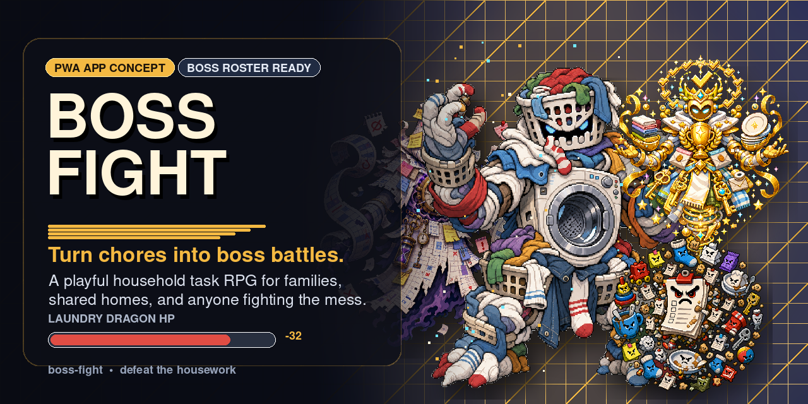
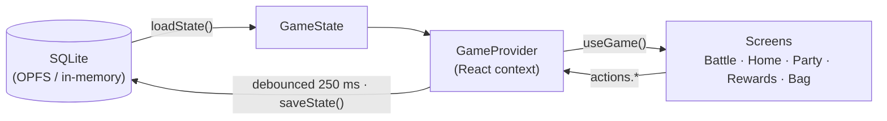

<div align="center">



# Boss Kamp

**Turn household chores into epic co-op boss battles.**

An offline-first PWA arcade-RPG for the whole family — every chore is an attack,
every finished task deals damage, and the recurring mess of daily life becomes
a roster of bosses you defeat together instead of another beige checklist.

[](https://react.dev)
[](https://www.typescriptlang.org)
[](https://vitejs.dev)
[](https://sqlite.org/wasm)
[](https://vite-pwa-org.netlify.app)

*Norsk 🇳🇴 first, English 🇬🇧 built in · no accounts · no server · your data never leaves the device*

</div>

---

## Why?

Chore apps die because they feel like homework. Boss Kamp reframes the same
work as a game your family already wants to play:

- The overflowing laundry basket isn't a task — it's **Vaskedragen** (the
  Laundry Dragon), and it respawns every day.
- Hanging up the clothes isn't a checkbox — it's an **18-damage attack**.
- Finishing the dishes together isn't "done" — it's a **boss kill**, with
  confetti, coins, XP, and an MVP.

The mess always comes back. Now, so do the bosses.

## ⚔️ How it plays

1. **Bosses spawn on real-life schedules.** Daily bosses (dishes, toys), weekly
   bosses (trash day, bathroom), monthly bosses (bills), and one *legendary*
   boss that appears when you least expect it.
2. **A boss's HP is the sum of its chores.** Tap an attack when the chore is
   done: big jobs crit (`damage ≥ 28`), quick wins chain into combos, and the
   HP bar melts with shakes, flashes, and floating damage numbers (plus
   synthesized retro SFX and haptics).
3. **Drop the boss, split the loot.** Each fighter earns coins proportional to
   the damage they dealt, damage becomes lifetime XP, and the top damage-dealer
   is crowned MVP.
4. **Spend coins on real rewards.** Personal treats (extra screen time, skip
   the dishes) or pool coins into the **fellespott** for shared prizes — movie
   night, pizza night, a weekend trip. Redeemed rewards become vouchers in your
   Bag to cash in whenever.
5. **Level up for life.** XP drives a career ladder from **Væpner** (squire) to
   **Mester** (master), one level every 120 XP.

Parents get a **parent mode** to edit everything: bosses, schedules, chores and
their damage, fighters, and reward pricing.

## 👹 The boss roster

Fifteen bosses ship out of the box — every one an enemy you already know.

| Boss | | Schedule |
| --- | --- | --- |
| **Vaskedragen** | the Laundry Dragon | daily |
| **Oppvaskhydraen** | the Dish Hydra — cut one plate down, two more appear | daily |
| **Smulekolossen** | the Crumb Colossus | daily |
| **Lekekjempen** | the Toyquake Titan | daily, before bedtime |
| **Sekkeskredet** | the Backpack Avalanche | daily, after school |
| **Huskelistehæren** | the To-do Horde | daily |
| **Gjøremålsgolemen** | the Chore Golem | weekly · Monday deep-clean |
| **Speilspøkelset** | the Mirror Smudge Phantom | weekly · Wednesday |
| **Søppelbehemoten** | the Trash Heap Behemoth | weekly · trash day |
| **Kabelslangen** | the Cable Serpent | weekly · Friday tech tidy |
| **Kjøleskapsråten** | the Fridge Rot Colossus | weekly · Saturday |
| **Sokkesluket** | the Sock Void | weekly · Sunday |
| **Papirkraken** | the Paper Kraken | monthly · bill day |
| **Kalendergjenferdet** | the Calendar Wraith | monthly · planning day |
| **✨ Den Gylne Gjøremesteren** | the Golden Done — animated, legendary | rare pseudo-random spawn |

All of them are editable, and you can create your own bosses from any recurring
mess in your home.

## 🧠 Tech

No frameworks-of-frameworks here. The stack is deliberately small:

| Concern | Choice |
| --- | --- |
| Build / dev | Vite 5 |
| UI | React 18 + TypeScript (strict, `noUnused*` as hard errors) |
| State | A single React context store — no state library |
| Styling | Inline styles + a handful of CSS `@keyframes` — no CSS framework |
| Persistence | [`@sqlite.org/sqlite-wasm`](https://sqlite.org/wasm) — a **real SQLite database in the browser** |
| PWA | `vite-plugin-pwa` (Workbox) — installable, fully offline |
| Audio | Hand-rolled WebAudio synth for SFX |

Runtime dependencies: **three** (`react`, `react-dom`, `sqlite-wasm`). That's it.

### A real SQLite database, in a browser tab

This isn't localStorage cosplaying as a database. `src/db/sqlite.ts` boots the
official SQLite WebAssembly build and prefers the **OPFS SAHPool VFS** — an
actual on-disk SQLite file living in the browser's Origin Private File System,
persistent across reloads, no cross-origin-isolation headers required. Where
OPFS isn't available it transparently falls back to an in-memory database
serialized to `localStorage` on every save, so the app stays persistent
everywhere (private mode included).

The schema is normalized (`bosses`, `chores`, `fighters`, `redemptions`, …),
versioned with `SCHEMA_VERSION`, and migrated non-destructively — new default
bosses can be backfilled onto existing saves without touching a player's edits.

### Architecture in one diagram



State flows one direction: SQLite → `GameState` → context → screens, and every
mutation goes back through `actions.*` and a debounced full-transaction save.
Durable game state and ephemeral UI state (tabs, combos, damage numbers) are
kept in separate slices — only the game slice ever touches the database. Pure
game math (schedules, cycles, HP, level curve) lives in `src/game/`, free of
React and DB imports.

```
src/
  main.tsx            Boot: open DB, load state, mount <GameProvider><App/>
  App.tsx             Tab router + overlays
  db/                 sqlite-wasm wrapper, schema + versioning, repository & migrations
  game/               Pure domain layer: types, seed data, schedule/HP/level logic, i18n
  store/              GameContext (all actions), WebAudio SFX + haptics
  screens/            Battle, Home, Party, Rewards, Bag + parent-mode managers & overlays
  ui/                 Shared bits: strings hook, boss sprite, avatar
```

## 🚀 Getting started

```bash
npm install
npm run dev       # dev server (note: service worker disabled in dev)
npm run build     # type-check + production build
npm run preview   # serve the production build — required to test PWA/offline
npm run lint      # type-check only (there is no ESLint — TS strict is the linter)
```

> [!IMPORTANT]
> The service worker only registers in the **production build**. Anything
> involving offline mode, caching, or installability must be verified with
> `npm run build && npm run preview`, never `npm run dev`.

There's no server to set up and no `.env` — clone, install, run.

## 🌍 Bilingual by design

Norwegian is the default language and the source of the domain vocabulary —
trigger types are literally `daglig`/`ukentlig`/`månedlig`/`sjelden` in the
code, chores are *gjøremål*, coins are *mynter*, the shared pool is the
*fellespott*. Every user-facing string exists in both `no` and `en` tables in
`src/game/i18n.ts`; if you touch UI copy, keep both languages in sync.

## 🔒 Privacy

There is no backend, no account, no analytics, and no network requirement after
install. Everything — bosses, fighters, avatars, coins, history — lives in a
SQLite database inside your browser's private storage on your own device.

## 🤝 Contributing

- Read [`CLAUDE.md`](CLAUDE.md) — it documents the architecture, conventions,
  and gotchas in depth (it's written for AI assistants, but it's just as useful
  for humans).
- Keep the dependency list tiny; no CSS/state/test frameworks without a strong
  reason.
- Run `npm run build` before pushing — the strict compiler (unused locals
  included) is the gatekeeper.
